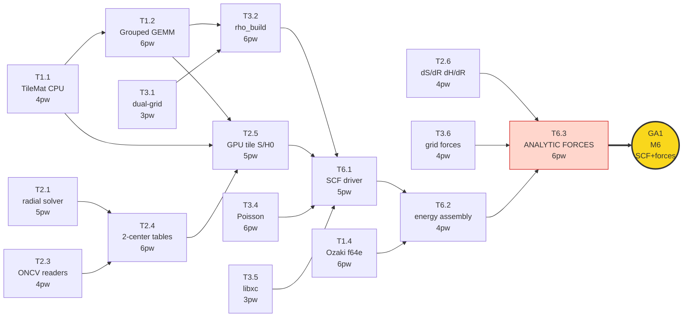
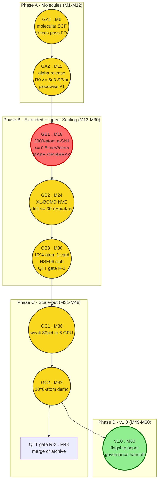
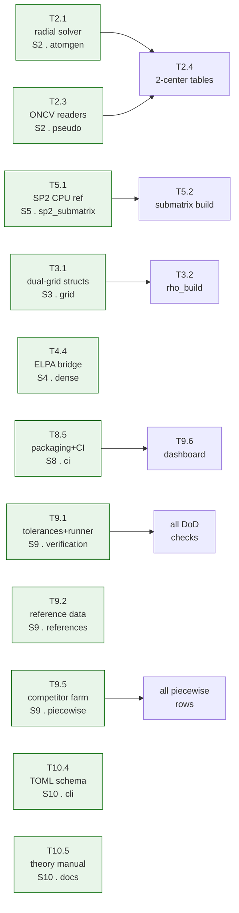
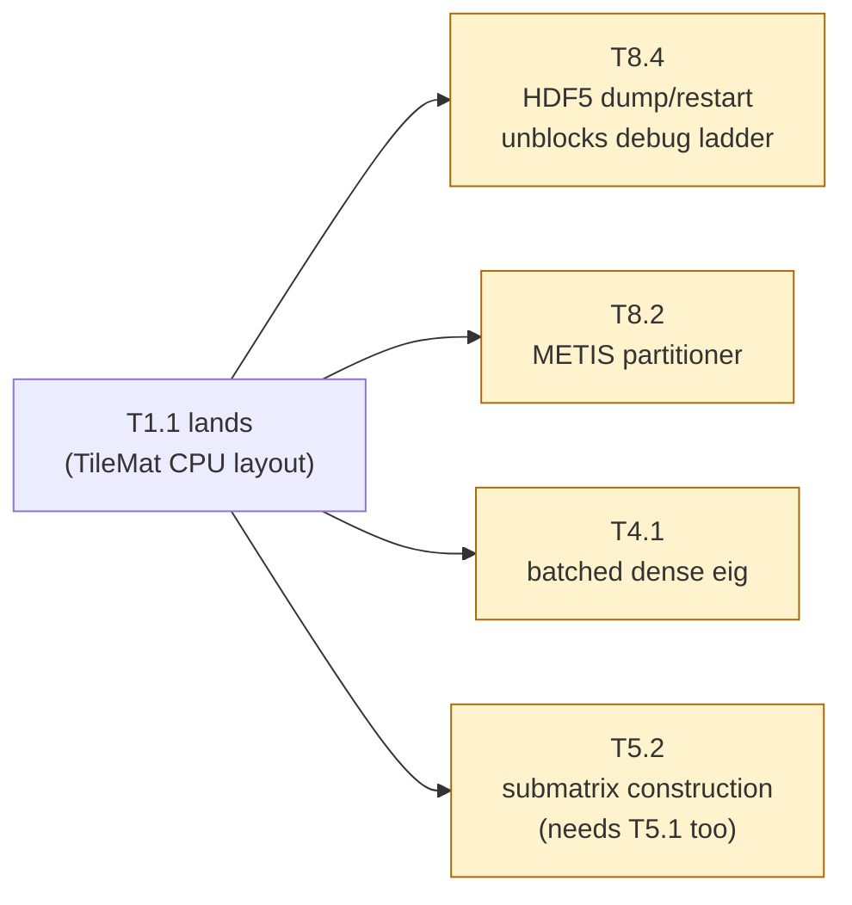

# TIDES — Task Dependency Graph & Execution Plan

> Source of truth: `40-engines/WPx-*.md` (task IDs, Depends, Unblocks, Effort, gates).
> Effort in person-weeks (pw). A task may start only when ALL "Depends" are green.
> Definition-of-Done = the Observables list; nothing is "done" until S9's harness shows it green.
> Repo rule (`30-architecture/30`): a directory = an owner; cross-directory changes need both owners' review.

---

## 1. Master Dependency Table (sorted by WP)

| Task ID | Title | Owner | Effort | Depends on | Unblocks | Phase |
|---|---|---|---|---|---|---|
| **T1.1** | TileMat core (CPU FP64 ref + layout) | S1 | 4 pw | – | ALL (first leaf) | A |
| **T1.2** | Grouped GEMM GPU path | S1 | 6 pw | T1.1 | T1.3–T1.6, T2.5, T3.2, T4.*, T5.*, T8.1 | A |
| **T1.3** | Filtered tile SpGEMM | S1 | 6 pw | T1.2 | T5.*, T7.4, T4.5 | A |
| **T1.4** | Ozaki f64e GEMM + reductions | S1 | 6 pw | T1.2 | T5.6, T6.2, all energy paths, T1.7 | A |
| **T1.5** | Deterministic mode | S1 | 2 pw | T1.2 | – | A |
| **T1.6** | CUDA-graph capture of solver sweeps | S1 | 3 pw | T1.2 | – | A |
| **T1.7** | Precision descriptors + error ledger API | S1 | 3 pw | T1.4 | T9.3 | A |
| **T1.8** | HIP build of substrate | S1 | 4 pw | T1.2–T1.4 | T8.7 | B |
| **T2.1** | Radial confined-atom solver (FP64 CPU) | S2 | 5 pw | – | T2.2, T2.4 | A |
| **T2.2** | NAO generation & optimization | S2 | 6 pw | T2.1, T2.3 | T2.7 | A |
| **T2.3** | ONCV readers (UPF2/PSML) + validators + ghost detector | S2 | 4 pw | – | T2.2, T2.4 | A |
| **T2.4** | Two-center tables (S,T,V_nl KB) + splines | S2 | 6 pw | T2.1, T2.3 | T2.5, T2.6, T7.6 | A |
| **T2.5** | GPU tile assembly of S, H0 | S2 | 5 pw | T1.1, T2.4 | T3.2, T6.1, T2.8 | A |
| **T2.6** | dS/dR, dH0/dR derivative streams | S2 | 4 pw | T2.4 | T6.3 | A |
| **T2.7** | Basis library release (H–Kr DZP + TZP) | S2 | 4 pw | T2.2 | – | A |
| **T2.8** | Bloch-phase (complex) tiles periodic R0/R1 | S2 | 4 pw | T2.5 | T6.4 | B |
| **T3.1** | Dual-grid layout + decomposition structs | S3 | 3 pw | – | T3.2, T3.4 | A |
| **T3.2** | rho builder (P -> n(r)) | S3 | 6 pw | T1.2, T2.5, T3.1 | T3.3, T3.5, T6.1, T7.2, T8.1 | A |
| **T3.3** | v -> H adjoint map | S3 | 4 pw | T3.2 | T3.6 | A |
| **T3.4** | Poisson: FFT + ISF (all BCs) | S3 | 6 pw | T3.1 | T6.1 | A |
| **T3.5** | libxc integration (LDA/GGA, collinear spin) | S3 | 3 pw | T3.2 | T6.1, T3.6 | A |
| **T3.6** | Grid force + stress terms | S3 | 4 pw | T3.3, T3.5 | T6.3 | A |
| **T3.7** | QTT-rho prototype (research flag) | S3 | 5 pw | T3.2 | T3.8 | B |
| **T3.8** | QTT-Poisson prototype (research flag) | S3 | 5 pw | T3.7 | gate R-1 | B |
| **T4.1** | Batched dense eigensolver path (R0) | S4 | 4 pw | T1.1 | T4.2 | A |
| **T4.2** | R0 batching driver | S4 | 6 pw | T4.1, T6.1 | T4.6, GA2 | A |
| **T4.3** | ChFSI core (filter, RR, locking, reuse) | S4 | 6 pw | T1.2 | T4.6, T6.5 | A |
| **T4.4** | ELPA / cuSOLVERMp bridge | S4 | 3 pw | – | (validation oracle) | A |
| **T4.5** | OMM direct minimization | S4 | 5 pw | T1.3 | T6.5 (alt) | A |
| **T4.6** | Broker + `tides tune` | S4 | 4 pw | T4.2, T4.3 | T10.3, all-regime UX | A |
| **T5.1** | SP2 CPU FP64 reference (sparse, small) | S5 | 3 pw | – | T5.2, T5.5 | A |
| **T5.2** | Submatrix construction (halo + batching) | S5 | 5 pw | T5.1, T1.1 | T5.3 | A |
| **T5.3** | GPU batched submatrix SP2, mixed [GB1] | S5 | 6 pw | T5.2, T1.3, T1.4 | T5.4, T5.7, T6.5, GB1 | B |
| **T5.4** | Truncation policy + error compensation | S5 | 4 pw | T5.3 | T5.8 | B |
| **T5.5** | FOE/Chebyshev density matrix (Mermin) | S5 | 6 pw | T1.3, T5.1 | T5.9 | A/B |
| **T5.6** | Fermi-level search in f64e | S5 | 2 pw | T1.4 | – | A |
| **T5.7** | Scale-out interface spec (document only) | S5 | 2 pw | T5.3 | T5.9, T8.6 | B |
| **T5.8** | 10^4-atom single-card run [GB3] | S5 | 5 pw | T5.4 | GB3 | B |
| **T5.9** | Distributed R2/R3 10^5–10^6 (Phase C) | S5 | 6 pw | T5.7, T8.6 | GC1, GC2 | C |
| **T6.1** | SCF driver + mixers (Pulay/Kerker/Broyden) | S6 | 5 pw | T2.5, T3.2, T3.4, T3.5 | T4.2, T6.2, T7.3, T10.1 | A |
| **T6.2** | Total energy assembly + Ewald | S6 | 4 pw | T6.1, T1.4 | T6.3 | A |
| **T6.3** | Analytic forces (HF+Pulay+grid+disp) [GA1] | S6 | 6 pw | T2.6, T3.6, T6.2 | T6.4, T6.5, T6.6, T7.1, T7.5, T10.7, T9.4, GA1 | A |
| **T6.4** | Stress tensor | S6 | 4 pw | T6.3, T2.8 | – | B |
| **T6.5** | XL-BOMD integrator (KSA, thermostats) [GB2] | S6 | 6 pw | T6.3 AND (T4.3 OR T5.3) | T6.8, GB2 | B |
| **T6.6** | ASPC warm starts + optimizers (FIRE, L-BFGS) | S6 | 4 pw | T6.3 | T6.7 | B |
| **T6.7** | NEB (climbing image) | S6 | 4 pw | T6.6 | – | B |
| **T6.8** | MD throughput record vs anchors | S6 | 3 pw | T6.5 | – | B |
| **T7.1** | D3(BJ)/D4 integration (E, F, stress) | S7 | 3 pw | T6.3 | – | B |
| **T7.2** | ISDF interpolation points + fit | S7 | 5 pw | T3.2 | T7.3 | B |
| **T7.3** | ACE construction + hybrid SCF | S7 | 6 pw | T7.2, T6.1 | T7.4, T7.5 | B |
| **T7.4** | Short-range HSE screening in tiles [GB3] | S7 | 5 pw | T7.3, T1.3 | GB3 | B |
| **T7.5** | Hybrid forces | S7 | 4 pw | T7.3, T6.3 | – | B |
| **T7.6** | PAW feasibility memo | S7 | 3 pw | T2.4 | M36 PAW decision | B |
| **T8.1** | Single-node 2-GPU data model (NCCL) | S8 | 6 pw | T1.2, T3.2 | T8.3 | B |
| **T8.2** | METIS tile partitioner | S8 | 3 pw | T1.1 | T8.3 | A |
| **T8.3** | Halo exchange + overlap | S8 | 4 pw | T8.1, T8.2 | T8.6 | B |
| **T8.4** | HDF5 stage-dump/restart | S8 | 4 pw | T1.1 | whole debug ladder | A |
| **T8.5** | Packaging + CI runners | S8 | 5 pw | – | T9.6, T10.8 | A |
| **T8.6** | MPI + NVSHMEM multi-node [GC1/GC2] | S8 | 6 pw | T5.7, T8.3 | T5.9, GC1, GC2 | C |
| **T8.7** | HIP quarterly gate | S8 | 3 pw/yr | T1.8 | – | B+ |
| **T9.1** | tolerances.yaml + runner framework | S9 | 4 pw | – | ALL DoD checks | A |
| **T9.2** | Reference data curation | S9 | 4 pw | – | rung-6 | A |
| **T9.3** | Nightly mixed-vs-FP64 A/B harness | S9 | 3 pw | T1.7 | – | A |
| **T9.4** | Nightly FD force checks | S9 | 3 pw | T6.3 | – | A |
| **T9.5** | Competitor farm (containers + parsers) | S9 | 6 pw | – | all piecewise rows | A |
| **T9.6** | Regression dashboard + energy metering | S9 | 4 pw | T8.5 | T9.7 | A |
| **T9.7** | Campaign runner + reproducibility archiver | S9 | 4 pw | T9.5, T9.6 | – | A/B |
| **T10.1** | nanobind bindings + Status objects | S10 | 5 pw | T6.1 | T10.2, T10.3, T10.7 | A |
| **T10.2** | ASE calculator | S10 | 4 pw | T10.1 | T10.6 | A |
| **T10.3** | CLI: run / tune / bench / verify | S10 | 4 pw | T10.1, T4.6 | – | A |
| **T10.4** | Input schema (TOML) + validator + auto-docs | S10 | 4 pw | – | (input contract) | A |
| **T10.5** | Theory manual with derivations | S10 | 5 pw+ | rolling | (merge gate) | A+ |
| **T10.6** | Five tutorials (double as integration tests) | S10 | 4 pw | T10.2 | – | A/B |
| **T10.7** | JAX bridge (Phase B/C) | S10 | 4 pw | T10.1, T6.3 | – | B/C |
| **T10.8** | Release engineering | S10 | 3 pw | T8.5 | v0.9, v1.0 | A+ |

---

## 2. Critical-Path Spine (PROTECT THIS)

The Phase-A critical path (`00-project/06-task-management-howto`):
`T1.1 -> T1.2 -> (T2.5 ∥ T3.2) -> T6.1 -> T6.3 -> GA1`
Any slip on this chain threatens the whole Phase A timeline.



**Day-zero parallel protectors of the spine** (these feed into the spine but start
independently of T1.1):
- **T2.1** (radial solver) + **T2.3** (ONCV readers) -> feed T2.4 -> T2.5
- **T3.1** (dual-grid structs) -> feeds T3.2

Starting T2.1, T2.3, and T3.1 on Day 0 removes the serialization delay at the
T1.2 -> {T2.5, T3.2} handoff.

---

## 3. Gate-Driven Milestone Map



**GB1 is the single highest-risk gate** (risk #1, M x H in `00-project/04`):
miss => fallback OMM/FOE for R2 + 2 quarters.

---

## 4. Task-to-Gate Evidence Map

| Gate | Month | Evidence task(s) | Critical dependency chain |
|---|---|---|---|
| **GA1** | M6 | T6.3 (forces) | T1.1 -> T1.2 -> T2.5 / T3.2 -> T6.1 -> T6.3 |
| **GA2** | M12 | T4.2 (R0 batching) | T4.1 -> T4.2 (+ T6.1) |
| **GB1** (highest risk) | M18 | T5.3 (submatrix SP2) | T5.1 -> T5.2 -> T5.3 (+ T1.3, T1.4) |
| **GB2** | M24 | T6.5 (XL-BOMD) | T6.3 AND (T4.3 OR T5.3) -> T6.5 |
| **GB3** | M30 | T5.8 (10^4-atom) + T7.4 (HSE slab) | T5.4 -> T5.8 ; T7.3 -> T7.4 |
| **GC1** | M36 | T5.9 + T8.6 (distributed) | T5.7 + T8.6 -> T5.9 |
| **GC2** | M42 | T5.9 + T8.6 (10^6 demo) | same |
| **R-1** (QTT) | M30 | T3.8 (QTT-Poisson prototype) | T3.7 -> T3.8 |
| **R-2** (QTT) | M48 | merge-or-archive decision | (continues iff R-1 passed) |

---

## 5. Day-Zero Parallel Launch (Depends: none, minimal interference)

These 11 tasks can start on Day 1 with **zero** cross-dependency on WP1, each
in a different owner's directory (per repo-layout rule, different owner + different
dir = minimal interference):



**Priority ranking:**

| Rank | Task(s) | Why |
|---|---|---|
| 1 | **T2.1 + T2.3** | Critical-path protectors — feed T2.4 -> T2.5 spine; starting now removes serialization delay at the T1.2 handoff |
| 2 | **T9.1 + T9.5 + T9.2** | Harness + competitor containers take real wall-clock time; T9.1 unblocks all DoD checks; T9.5 unblocks all piecewise rows |
| 3 | **T8.5** | Unblocks everyone's dev env in <= 30 min; also unblocks T9.6, T10.8 |
| 4 | **T5.1** | Early de-risk of the #1 project risk (GB1); CPU FP64 SP2 reference is the oracle for T5.3 |
| 5 | T3.1, T10.4, T10.5, T4.4 | Light, contract-defining; T10.5 is a merge gate anyway |

---

## 6. Second Wave (start the day T1.1 lands, ~4 pw)



T8.4 is the highest-value second-wave task: *"unblocks the whole debug ladder"*
(HDF5 stage-dump/restart = the bisect-the-physics enabler from `30-architecture/31`).

---

## 7. Full Task-Dependency DAG (all 65 tasks)

```mermaid
flowchart TB
    subgraph WP1["WP1 Tile substrate (S1)"]
        T11["T1.1"] --> T12["T1.2"]
        T12 --> T13["T1.3"]
        T12 --> T14["T1.4"]
        T12 --> T15["T1.5"]
        T12 --> T16["T1.6"]
        T14 --> T17["T1.7"]
        T12 --> T18["T1.8"]
        T13 --> T18
        T14 --> T18
    end
    subgraph WP2["WP2 Basis (S2)"]
        T21["T2.1"] --> T24["T2.4"]
        T23["T2.3"] --> T22["T2.2"]
        T21 --> T22
        T23 --> T24
        T24 --> T25["T2.5"]
        T24 --> T26["T2.6"]
        T22 --> T27["T2.7"]
        T25 --> T28["T2.8"]
    end
    subgraph WP3["WP3 Grid (S3)"]
        T31["T3.1"] --> T32["T3.2"]
        T32 --> T33["T3.3"]
        T31 --> T34["T3.4"]
        T32 --> T35["T3.5"]
        T33 --> T36["T3.6"]
        T35 --> T36
        T32 --> T37["T3.7"]
        T37 --> T38["T3.8"]
    end
    subgraph WP4["WP4 Solvers (S4)"]
        T41["T4.1"] --> T42["T4.2"]
        T43["T4.3"]
        T44["T4.4"]
        T45["T4.5"]
        T42 --> T46["T4.6"]
        T43 --> T46
    end
    subgraph WP5["WP5 Linear scaling (S5)"]
        T51["T5.1"] --> T52["T5.2"]
        T52 --> T53["T5.3"]
        T53 --> T54["T5.4"]
        T51 --> T55["T5.5"]
        T53 --> T57["T5.7"]
        T54 --> T58["T5.8"]
        T57 --> T59["T5.9"]
        T55 --> T59
    end
    subgraph WP6["WP6 SCF/MD (S6)"]
        T61["T6.1"] --> T62["T6.2"]
        T62 --> T63["T6.3"]
        T63 --> T64["T6.4"]
        T63 --> T65["T6.5"]
        T63 --> T66["T6.6"]
        T66 --> T67["T6.7"]
        T65 --> T68["T6.8"]
    end
    subgraph WP7["WP7 Hybrids (S7)"]
        T72["T7.2"] --> T73["T7.3"]
        T73 --> T74["T7.4"]
        T73 --> T75["T7.5"]
        T76["T7.6"]
        T71["T7.1"]
    end
    subgraph WP8["WP8 Parallel (S8)"]
        T81["T8.1"] --> T83["T8.3"]
        T82["T8.2"] --> T83
        T83 --> T86["T8.6"]
        T84["T8.4"]
        T85["T8.5"]
        T86 --> T87q["T8.7 gate"]
        T18 --> T87["T8.7"]
    end
    subgraph WP9["WP9 Verification (S9)"]
        T91["T9.1"]
        T92["T9.2"]
        T17 --> T93["T9.3"]
        T63 --> T94["T9.4"]
        T95["T9.5"]
        T85 --> T96["T9.6"]
        T96 --> T97["T9.7"]
        T95 --> T97
    end
    subgraph WP10["WP10 API (S10)"]
        T101["T10.1"] --> T102["T10.2"]
        T101 --> T103["T10.3"]
        T46 --> T103
        T104["T10.4"]
        T105["T10.5"]
        T102 --> T106["T10.6"]
        T101 --> T107["T10.7"]
        T63 --> T107
        T85 --> T108["T10.8"]
    end

    T11 --> T25
    T12 --> T25
    T12 --> T32
    T12 --> T43
    T12 --> T81
    T13 --> T53
    T13 --> T45
    T13 --> T55
    T13 --> T74
    T14 --> T62
    T14 --> T56["T5.6"]
    T25 --> T61
    T32 --> T61
    T34 --> T61
    T35 --> T61
    T61 --> T42
    T26 --> T63
    T36 --> T63
    T63 --> T71
    T63 --> T75
    T32 --> T72
    T61 --> T73
    T53 --> T65
    T43 --> T65
    T63 --> T65
    T63 --> T66
    T28 --> T64
    T63 --> T64
    T24 --> T76
    T57 --> T86
    T86 --> T59
    T11 --> T82
    T11 --> T84
    T11 --> T41
    T11 --> T52
    T61 --> T101
    T65 --> T68
    T68 --> GB2["GB2"]
    T53 --> GB1["GB1"]
    T58 --> GB3a["GB3"]
    T74 --> GB3b["GB3"]
    T42 --> GA2["GA2"]
    T63 --> GA1["GA1"]
    T59 --> GC1["GC1"]
    T59 --> GC2["GC2"]
    T86 --> GC1
    T86 --> GC2
    style GA1 fill:#f9d71c,stroke:#333,stroke-width:3px
    style GA2 fill:#f9d71c,stroke:#333,stroke-width:3px
    style GB1 fill:#ff6b6b,stroke:#c00,stroke-width:3px
    style GB2 fill:#f9d71c,stroke:#333,stroke-width:3px
    style GB3a fill:#f9d71c,stroke:#333,stroke-width:3px
    style GC1 fill:#f9d71c,stroke:#333,stroke-width:3px
    style GC2 fill:#f9d71c,stroke:#333,stroke-width:3px
```



> Diagram note: cross-WP edges (the unlabelled arrows between subgraphs) carry the
> actual contract dependencies. Intra-WP chains are shown inside each subgraph.
> Gate nodes (GA1/GA2/GB1/GB2/GB3/GC1/GC2) are colored: red = make-or-break, yellow = standard gate.

---

## 8. Effort Roll-Up by WP

| WP | Owner | Sigma effort (pw) | Phase start | Largest task |
|---|---|---|---|---|
| WP1 | S1 | 34 | A | T1.2, T1.3, T1.4 (6 pw each) |
| WP2 | S2 | 38 | A | T2.4 (6 pw) |
| WP3 | S3 | 36 | A | T3.2, T3.4 (6 pw each) |
| WP4 | S4 | 28 | A | T4.2, T4.3 (6 pw each) |
| WP5 | S5 | 39 | A -> C | T5.3, T5.5, T5.9 (6 pw each) |
| WP6 | S6 | 36 | A -> B | T6.3, T6.5 (6 pw each) |
| WP7 | S7 | 26 | B | T7.3 (6 pw) |
| WP8 | S8 | 31 | A -> C | T8.1, T8.6 (6 pw each) |
| WP9 | S9 | 28 | A | T9.5 (6 pw) |
| WP10 | S10 | 33 | A -> D | T10.1, T10.5 (5 pw) |
| **Total** | | **329 pw** | | |

Note: WP5 carries the most effort (39 pw) and the highest-risk gate (GB1).
WP7 starts latest (Phase B) and has the lightest load (26 pw).

---

## 9. Status Tracking Template (per task)

Copy one block per assigned task into issues:

```markdown
### T<wp>.<n> - <title>
- Owner: S<n>
- Status: [ ] not started | [~] in progress | [x] green | [!] blocked
- Depends: <IDs> (status of each: [x]/[~]/[ ])
- Unblocks: <IDs>
- Effort: <pw> (started __, done __)
- Observables green: [ ]1 [ ]2 [ ]3 ...
- Device: RTX / A40 / H100
- Blocker: <none / T_id / reason>
```

**Weekly per owner (per `00-project/06-task-management-howto`):**
1. tasks green
2. observable currently failing
3. blocker

**Rules (`00-project/06`):**
- A task must fit <= 6 person-weeks; if not, the owner splits it and updates the WP file by PR.
- A task may start only when all "Depends" are green.
- Changing an Observable requires S9 approval, recorded in the WP file.

---

## 10. Legend

| Symbol | Meaning |
|---|---|
| `->` | depends on (arrow points from dependency to dependent) |
| `Depends -` | no dependencies (launchable Day 0) |
| `[GAx]` / `[GBx]` / `[GCx]` | gate evidence task |
| `pw` | person-weeks |
| `R0`-`R3` | solver regimes: R0 batch-dense, R1 ChFSI/dense, R2 SP2-submatrix, R3 FOE/SQ |
| S1-S10 | scientist/owner IDs (see `00-project/03`) |
| red gate | make-or-break (GB1); miss => fallback + 2 quarters |
